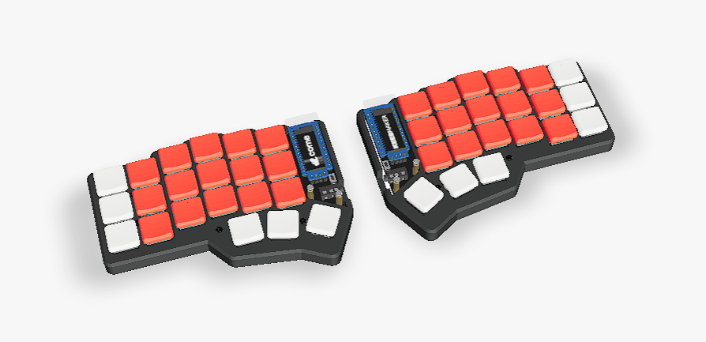

# corne crkbd split

Open the cloned repo inside [QMK MSYS](https://msys.qmk.fm/)

Create a named directory under the keyboards then copy the files

```bash
mkdir -p /c/Users/"$(whoami)"/qmk_firmware/keyboards/crkbd/keymaps/"$(whoami)"
cp *.c *.h *.mk /c/Users/"$(whoami)"/qmk_firmware/keyboards/crkbd/keymaps/"$(whoami)"
```

Compile the code and flash it with [QMK Toolbox](https://qmk.fm/toolbox)

```bash
qmk compile -kb crkbd/rev1 -km "$(whoami)"
```


